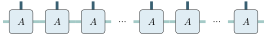
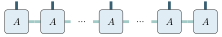
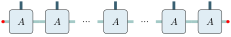
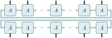

mptikz - graphical tensor notation for LuaTeX
=============================================

The mptikz package provides convenience functions for drawing tensor networks in graphical notation.
Right now, it manly deals with the 1D tensor networks, i.e. matrix-product states and operators, but it's readily extensible.

The original creator of this package is user `dsuess`, this is an extension of his work.


## Installation

Just copy the `mptikz.sty` file in your working directory or any directory in the search path of LuaTeX.

## Drawing single nodes

Drawing a single tensor is as easy as loading the mptikz package via `\usepackage{mptikz}` and running the following command inside a tikzpicture.

```latex
\tensor{{N=2, S=3, E=1}}
```

Note the double `{{}}`.
This draws a tensor with 1, 2, and 3 legs on the left (EAST), top (NORTH), and bottom (SOUTH) position, respectively.

<p align='center'>
	
</p>

See [example_1.tex](example_1.tex) for the full source code.
Note that all examples rely on `lualatex`, see the [Makefile](Makefile) for how to compile the pictures in this repo.

`mptikz` automatically names tensors and the legs, which then can be used to add annoations to the graph (see [example_2.tex](example_2.tex) for the full source code).
Also, the exaple below shows how to customize the look of the tensors using the `tensor_style` properties passed to the `\tensor` command.
It accepts any valid TikZ style including (as shown below) the name of predefined styles.

```latex
\tikzstyle{tensornode}=[draw,minimum size=1, fill=orange, rounded corners=0.1cm]
\tensor{{N=1, tensor_name='A', tensor_style='tensornode', len_vertical_legs=1, leg_style='line width= .2mm', leg_color_NS='black'}}
\node at (A) {$A$};
\node [anchor=west] at (A_N1) {$i$};
```

<p align='center'>
	
</p>

For each legs, two different TikZ coordinates are defined:
`A_N1` stands for the middle first northern leg of the tensor `A` and `A_N1e` stands for the end of that leg.

## Drawing more complex MPAs

For drawing chain of tensors (so called Matrix Product Arrays), we provide the `\mpa` functions shown below.
We also show how to manipulate the default values for styling using the `\tensorstyle` command.
See [example_3.tex](example_3.tex) for the full code

```latex
\tensorstyle{{len_vertical_legs=0.25, tensor_style='draw, fill=orange, rounded corners=0.1cm', leg_style='line width= .2mm', leg_color_NS='black', leg_color_EW='black'}}
% Draw MPA manually
\tensor{{S=1, W=1, E=1, x=0}}
\tensor{{S=1, W=1, E=1, x=1.25}}
\tensor{{S=1, W=1, E=1, x=2.5}}

% Draw MAP using appropriate function
\tensorstyle{{tensor_style='draw, fill=green, rounded corners=0.1cm'}}
\mpa{3}{{N=1, E=1, W=1, y=-1.25, tensor_name='A'}}
\node at (A_1_2) {$A$};
```

<p align='center'>
	
</p>

### Block structure

More generally, the first input to `\mpa` is expected to be an array of integers, and the function will draw blocks of tensors separated by ellipses according to the input. As shown in [example_4.tex](example_4.tex) for the input `{3,2,1}` we get 3 blocks: the first with 3 tensors, the second with 2 and the last with 1. The function `\tlabel` also allows to name every tensor in the array at once (to use a `\` in the label, to put for instance a greek letter, one has to use `\\` instead, more on that below).

```latex
\tensorstyle{{len_horizontal_legs=0.22, len_vertical_legs = 0.3, x=1.4, tensor_width=0.85, tensor_height=0.85 }}
\mpa{{3,2,1}}{{N=1,E=1,W=1, y=0.65, tensor_name='A'}}

\tlabel{'A'}{{ label='$A$' }}
```
<p align='center'>
	
</p>

For naming the tensors, we simply append `_i_j` to the given name, where `i` is the number of the block and `j` is the number of the tensor within the block (both starting with 1).
Therefore, if we want to address the northern leg of the 2nd tensor in the 1st block, we can use the keys `A_1_2_N1` and `A_1_2_N1e`.

### Traces and removing external legs

To draw structures akin to those of Matrix Product States one often has to trace out elements in the diagram. The `\mpa` command allows to do so in two ways. First the `\mpa` command has an optional argument that can take the values `-1`, `0`, `1` and `2`.

* `0` is the default value and does nothing.

* `-1` removes the most external (East-West) legs, as shown in [example_5.tex](example_5.tex):

```latex
\tensorstyle{{len_horizontal_legs=0.22, len_vertical_legs = 0.3, x=1.4, tensor_width=0.85, tensor_height=0.85 }}
\mpa[-1]{{2,1,2}}{{N=1,E=1,W=1, y=0.65, tensor_name='A'}}

\tlabel{'A'}{{ label='$A$' }}
```

<p align='center'>
	
</p>


* `1` adds red dots on the most external (East-West) legs, as shown in [example_6.tex](example_6.tex):

```latex
\tensorstyle{{len_horizontal_legs=0.22, len_vertical_legs = 0.3, x=1.4, tensor_width=0.85, tensor_height=0.85 }}
\mpa[1]{{2,1,2}}{{N=1,E=1,W=1, y=0.65, tensor_name='A'}}

\tlabel{'A'}{{ label='$A$' }}
```
<p align='center'>
	
</p>

This is a more "tidy" version of `2`.

* `2` makes most external (East-West) legs loop around as shown in [example_7.tex](example_7.tex), so they are easier to link as shown in [example_8.tex](example_8.tex).

Example 7:

```latex
\tensorstyle{{len_horizontal_legs=0.22, len_vertical_legs = 0.3, x=1.4, tensor_width=0.85, tensor_height=0.85 }}
\mpa[2]{{2,1,2}}{{N=1,E=1,W=1, y=0.65, tensor_name='A'}}

\tlabel{'A'}{{ label='$A$' }}
```

<p align='center'>
	
</p>

Example 8:

```latex
\tensorstyle{{trace_offsetEW=-0.3, len_horizontal_legs=0.22, len_vertical_legs = 0.3, x=1.4, tensor_width=0.85, tensor_height=0.85}}
\mpa[2]{{2,1,2}}{{N=1,E=1,W=1, y=0.65, tensor_name='A1'}}
	
\draw[line width=1mm, leg_color_EW] (A1_1_1_W1e) -- (A1_3_2_E1e);
	
\tensorstyle{{trace_extensionEW=3}}
	
\mpa[2]{{2,1,2}}{{S=1,E=1,W=1, y=-0.65, tensor_name='A2', trace_inverterE=-1, trace_inverterW=-1}}
	
\tlabel{'A1'}{{ label='$A$' }}
\tlabel{'A2'}{{ label='$\\bar{A}$' }}
```

<p align='center'>
	
</p>

This examples features two ways to link the lines that were looped by the option: 

1. By using the `\draw` command of tikz with the tikz coordinates for the ends of the lines. The color names `leg_color_EW` and `leg_color_NS` are loaded with the package to the default values for horizontal and vertical legs respectively.
2. By the `trace_extensionEW` option. This styling option only works with the `2` optional argument of `\mpa`. It extends the legth of the line by the given argument, therefore changing the position of the tikz coordinate corresponding to the end of the line. It accepts negative inputs to reduce the length of the line.

The vertical displacement of the looped line changed between the two examples. This is thanks to the `trace_offsetEW` option which allows to control for the displacement of the line looping back.

The `trace_inverterE=-1` and `trace_inverterW=-1` allow us to change the side on which the line is looped around in example 8.


<!--There are many more options that come into play for `\mpa[2]`, they are all listed here:

* a-->


### Labelling

## Tensor Style Parameters


## Lua Interface

Beside the TeX interface, we also provide a Lua interface to the drawing functions.
See [example_e.tex](example_e.tex) for the full code.

```Lua
for i = 1, nr_rows do
  local name = string.format('T%i', i)
  mptikz.draw_mpa(nr_cols, {y=-(i - 1) * 1.5, tensor_name=name})

  for j = 1, nr_cols do
    local node_name = string.format('T%i_%i', i, j)
    local node_label = string.format('$T_{%i,%i}$', i, j)
    local tex_cmd = string.format('\\node at (%s) {%s};', node_name, node_label)
    tex.print(tex_cmd)
  end
end
```

<p align='center'>
	
</p>


## More examples

For more examples, see the [documentation of mpnum](https://github.com/dseuss/mpnum/tree/feat-docs/docs/fig).
However, the interface of mptikz has since been updated.
Many of the things there could have been down easier using the pure latex interface.


## Why LuaTeX?

Sure, mptikz could just as well be implemented in pure PGF/TikZ.
But the syntax is slightly messy at best and learning Lua is time well spend for me anyway.
Also, by using TikZ externalize feature, one can compile the document with pdftex, which is generally faster, and only compile the TikZ images using LuaTeX.
