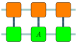

mptikz - graphical tensor notation for LuaTeX
=============================================

The mptikz package provides convenience functions for drawing tensor networks in graphical notation.
Right now, it manly deals with the 1D tensor networks, i.e. matrix-product states and operators, but it's readily extensible.

## Drawing single nodes

Drawing a simple tensor node is as easy as

```latex
\begin{luacode}
  mpt = require('mptikz')
  mpt.draw_node({N=2, S=3, E=1})
\end{luacode}
```

This draws a tensor with 1, 2, and 3 legs on the left (EAST), top (NORTH), and bottom (SOUTH) position, respectively.

<p align='center'>
	
</p>

See [example_1.tex](example_1.tex) for the full source code.
Note that all examples rely on `lualatex`, see the [Makefile](Makefile) for the full compilation pipeline.

`mptikz` automatically names tensors and the legs, which then can be used to add annoations to the graph (see [example_2.tex](example_2.tex) for the full source code).
Also, the exaple below shows how to customize the look of the tensors using the `tensor_style` argument.
It accepts any valid TikZ style including (as shown below) the name of predefined styles.

```latex
\tikzstyle{tensornode}=[draw,minimum size=1, fill=green, rounded corners=0.1cm]

\begin{luacode}
  local mpt = require('mptikz')
  mpt.draw_node({N=1, tensor_name='A', tensor_style='tensornode', len_vertical_legs=1})
\end{luacode}

\node at (A) {$A$};
\node [anchor=west] at (A_N1) {$i$};
```

<p align='center'>
	
</p>


## Drawing more complex MPAs

The task of drawing longer chains of tensors such as MPAs can become tedious.
Therefore, we provide the `draw_mpa` function shown below, which yields the same ressult as the manual drawing in the same example.
We also show how to manipulate the `mpt.defaults` table in order to change the styling of tensors globally.
See [example_3.tex](example_3.tex) for the full code

```latex
local style = 'draw, fill=orange, rounded corners=0.1cm'
mpt.defaults['len_vertical_legs'] = 0.25
mpt.defaults['tensor_style'] = style

-- Draw MPA manually
mpt.draw_node({S=1, W=0, E=1, x=0})
mpt.draw_node({S=1, W=1, E=1, x=1.5})
mpt.draw_node({S=1, W=1, E=0, x=3.0})

-- Draw MPA using appropriate function
mpt.defaults['tensor_style'] = style .. ', fill=green'
mpt.draw_mpa(3, {N=1, y=-1.5, tensor_name='A'})
```

<p align='center'>
	
</p>


## More examples

For more examples, see the [documentation of mpnum](https://github.com/dseuss/mpnum/tree/feat-docs/docs/fig).

## Why LuaTeX?

Sure, mptikz could just as well be implemented in pure PGF/TikZ.
But the syntax is slightly messy at best and learning Lua is time well spend for me anyway.
Also, by using TikZ externalize feature, one can compile the document with pdftex, which is generally faster, and only compile the TikZ images using LuaTeX.

